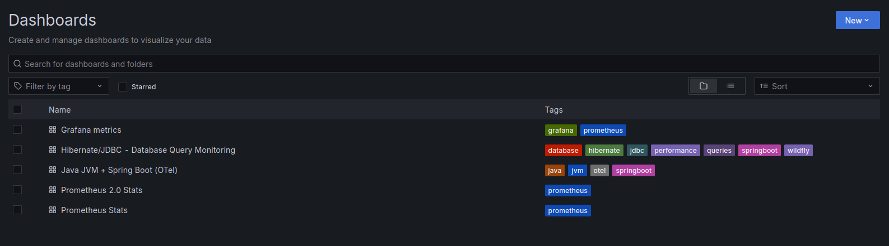

# Stack de observabilidade completo
[](https://openjdk.org/)
[](https://opentelemetry.io/)
[](https://www.jaegertracing.io/)
[](https://prometheus.io/)
[](https://grafana.com/)

---

### OpenTelemetry, Jaeger, Prometheus e Grafana

Este ambiente fornece **observabilidade completa** para aplicações Java (WildFly, Spring Boot, Quarkus) com:
- **Tracing distribuído** com Jaeger
- **Métricas JVM e aplicação** com Prometheus
- **Dashboards interativos** com Grafana
- **Autoinstrumentação** via OpenTelemetry Java Agent

---

## Quick Start

### 1. Subir o stack completo
```bash
docker compose up -d
```

### 2. Verificar se todos os serviços estão rodando
```bash
docker compose ps
```

### 3. Testar conectividade
```bash
# Teste o collector OTLP
curl -X POST http://localhost:4318/v1/traces \
  -H "Content-Type: application/json" \
  -d '{"resourceSpans":[]}'

# Deve retornar: {"partialSuccess":{}}
```

---

## Serviços Disponíveis

| Serviço               | URL                           | Descrição                           | Credenciais       |
|-----------------------|-------------------------------|-------------------------------------|-------------------|
| **Grafana**           | http://localhost:3000         | Dashboards e visualizações          | `admin/admin123`* |
| **Jaeger UI**         | http://localhost:16686        | Interface de tracing distribuído    | -                 |
| **Prometheus**        | http://localhost:9090         | Métricas e alertas                  | -                 |
| **Collector Metrics** | http://localhost:9464/metrics | Métricas do OpenTelemetry Collector | -                 |

> \* Defina, se preferir seu próprio usuário e senha
---

## Configuração da Aplicação Java

### Download do Agent
```bash
# Criar diretório
destino_opentelmetry=~/dev/opentelmetry/agent/
mkdir -p $destino_opentelmetry

# Download da versão mais recente
curl -L -o $destino_opentelmetry/opentelemetry-javaagent.jar \
  https://github.com/open-telemetry/opentelemetry-java-instrumentation/releases/latest/download/opentelemetry-javaagent.jar
```

### Configuração Completa (Recomendada)

Para **máxima observabilidade** com JVM, HTTP, Database, etc:

> Atenção: considere o caminho do agente do passo anterior, abaixo está o caminho da minha máquina

```bash
export JAVA_OPTS="$JAVA_OPTS \
  -javaagent:/home/halisson/dev/opentelmetry/agent/opentelemetry-javaagent.jar \
  -Dotel.service.name=wildfly-app \
  -Dotel.service.version=1.0.0 \
  -Dotel.deployment.environment=development \
  -Dotel.exporter.otlp.endpoint=http://localhost:4318 \
  -Dotel.exporter.otlp.protocol=http/protobuf \
  -Dotel.instrumentation.jvm-metrics.enabled=true \
  -Dotel.instrumentation.runtime-metrics.enabled=true \
  -Dotel.instrumentation.jdbc.enabled=true \
  -Dotel.instrumentation.jpa.enabled=true \
  -Dotel.instrumentation.hikaricp.enabled=true \
  -Dotel.instrumentation.servlet.enabled=true \
  -Dotel.instrumentation.http.enabled=true \
  -Dotel.instrumentation.logging.enabled=true \
  -Dotel.metric.export.interval=5000 \
  -Dotel.traces.sampler=traceidratio \
  -Dotel.traces.sampler.arg=1.0"
```

### Configuração Minimalista
Para testes rápidos:
```bash
export JAVA_OPTS="$JAVA_OPTS \
  -javaagent:/home/halisson/dev/opentelmetry/agent/opentelemetry-javaagent.jar \
  -Dotel.service.name=minha-app \
  -Dotel.exporter.otlp.endpoint=http://localhost:4318"
```

### Configuração com Endpoints Específicos
Se preferir especificar cada endpoint:
```bash
export JAVA_OPTS="$JAVA_OPTS \
  -javaagent:/home/halisson/dev/opentelmetry/agent/opentelemetry-javaagent.jar \
  -Dotel.service.name=wildfly-app \
  -Dotel.exporter.otlp.traces.endpoint=http://localhost:4318/v1/traces \
  -Dotel.exporter.otlp.metrics.endpoint=http://localhost:4318/v1/metrics \
  -Dotel.exporter.otlp.logs.endpoint=http://localhost:4318/v1/logs \
  -Dotel.exporter.otlp.protocol=http/protobuf"
```

---

## Configuração do Grafana

### 1. Primeiro Acesso
1. Acesse http://localhost:3000
2. Login: `admin` / Senha: `admin123`
3. Altere a senha quando solicitado

### 2. Configurar Data Sources

#### Prometheus (Métricas)
```
Configuration → Data Sources → Add data source → Prometheus
URL: http://prometheus:9090
Access: Server (default)
```

#### Jaeger (Traces) - Opcional
```
Configuration → Data Sources → Add data source → Jaeger  
URL: http://jaeger:16686
Access: Server (default)
```

### 3. Importar Dashboards Prontos

**Opção 1: IDs da Comunidade**
- Dashboard ID `4701` - JVM (Micrometer)
- Dashboard ID `11378` - JVM Applications
- Dashboard ID `14114` - PostgreSQL

**Opção 2: Dashboards Customizados**
- Copie o JSON dos dashboards abaixo
- Grafana → Import → Cole o JSON

---

## Dashboard JVM + Spring Boot

<details>
<summary> Clique para ver o JSON completo do Dashboard JVM</summary>

```json
{
  "id": null,
  "title": "Java JVM + Application Metrics",
  "tags": ["java", "jvm", "otel", "performance"],
  "timezone": "browser",
  "schemaVersion": 39,
  "version": 2,
  "time": {
    "from": "now-15m",
    "to": "now"
  },
  "refresh": "10s",
  "panels": [
    {
      "id": 1,
      "type": "stat",
      "title": "Application Health",
      "gridPos": {"h": 4, "w": 6, "x": 0, "y": 0},
      "targets": [
        {
          "expr": "up{job=\"otel-collector\"}",
          "legendFormat": "Collector Status"
        }
      ],
      "fieldConfig": {
        "defaults": {
          "color": {"mode": "thresholds"},
          "thresholds": {
            "steps": [
              {"color": "red", "value": 0},
              {"color": "green", "value": 1}
            ]
          }
        }
      }
    },
    {
      "id": 2,
      "type": "timeseries",
      "title": "Heap Memory Usage",
      "gridPos": {"h": 8, "w": 12, "x": 0, "y": 4},
      "targets": [
        {
          "expr": "jvm_memory_used_bytes{area=\"heap\"}",
          "legendFormat": "Used - {{id}}"
        },
        {
          "expr": "jvm_memory_max_bytes{area=\"heap\"}",
          "legendFormat": "Max - {{id}}"
        }
      ],
      "fieldConfig": {
        "defaults": {
          "unit": "bytes",
          "custom": {"drawStyle": "line", "fillOpacity": 10}
        }
      }
    },
    {
      "id": 3,
      "type": "timeseries", 
      "title": "Garbage Collection",
      "gridPos": {"h": 8, "w": 12, "x": 12, "y": 4},
      "targets": [
        {
          "expr": "rate(jvm_gc_collection_seconds_sum[5m])",
          "legendFormat": "GC Time - {{gc}}"
        },
        {
          "expr": "rate(jvm_gc_collection_seconds_count[5m])",
          "legendFormat": "GC Frequency - {{gc}}"
        }
      ],
      "fieldConfig": {
        "defaults": {
          "unit": "s"
        }
      }
    },
    {
      "id": 4,
      "type": "timeseries",
      "title": "Thread Count",
      "gridPos": {"h": 6, "w": 8, "x": 0, "y": 12},
      "targets": [
        {
          "expr": "jvm_threads_live_threads",
          "legendFormat": "Live Threads"
        },
        {
          "expr": "jvm_threads_daemon_threads", 
          "legendFormat": "Daemon Threads"
        }
      ]
    },
    {
      "id": 5,
      "type": "timeseries",
      "title": "HTTP Requests Rate",
      "gridPos": {"h": 6, "w": 8, "x": 8, "y": 12},
      "targets": [
        {
          "expr": "rate(http_server_requests_seconds_count[1m])",
          "legendFormat": "{{method}} {{uri}} - {{status}}"
        }
      ],
      "fieldConfig": {
        "defaults": {
          "unit": "reqps"
        }
      }
    },
    {
      "id": 6,
      "type": "timeseries",
      "title": "HTTP Response Time",
      "gridPos": {"h": 6, "w": 8, "x": 16, "y": 12},
      "targets": [
        {
          "expr": "histogram_quantile(0.95, rate(http_server_requests_seconds_bucket[5m]))",
          "legendFormat": "95th percentile"
        },
        {
          "expr": "histogram_quantile(0.50, rate(http_server_requests_seconds_bucket[5m]))",
          "legendFormat": "50th percentile"
        }
      ],
      "fieldConfig": {
        "defaults": {
          "unit": "s"
        }
      }
    }
  ]
}
```
</details>

---

## Dashboard Hibernate/JDBC

<details>
<summary>Clique para ver o JSON completo do Dashboard Database</summary>

```json
{
  "id": null,
  "title": "Database & JDBC Performance Monitor",
  "tags": ["hibernate", "jdbc", "database", "performance"],
  "timezone": "browser", 
  "schemaVersion": 39,
  "time": {"from": "now-1h", "to": "now"},
  "refresh": "30s",
  "panels": [
    {
      "id": 1,
      "type": "stat",
      "title": "Database Health Alert",
      "gridPos": {"h": 4, "w": 8, "x": 0, "y": 0},
      "targets": [
        {
          "expr": "hikaricp_connections_timeout_total > 0",
          "legendFormat": "Connection Timeouts"
        }
      ],
      "fieldConfig": {
        "defaults": {
          "color": {"mode": "thresholds"},
          "thresholds": {
            "steps": [
              {"color": "green", "value": 0},
              {"color": "red", "value": 1}
            ]
          }
        }
      }
    },
    {
      "id": 2,
      "type": "timeseries",
      "title": "Connection Pool Status",
      "gridPos": {"h": 8, "w": 12, "x": 0, "y": 4},
      "targets": [
        {
          "expr": "hikaricp_connections_active",
          "legendFormat": "Active"
        },
        {
          "expr": "hikaricp_connections_idle", 
          "legendFormat": "Idle"
        },
        {
          "expr": "hikaricp_connections_max",
          "legendFormat": "Max"
        }
      ]
    },
    {
      "id": 3,
      "type": "timeseries",
      "title": "⚡ Query Performance",
      "gridPos": {"h": 8, "w": 12, "x": 12, "y": 4},
      "targets": [
        {
          "expr": "rate(hibernate_query_execution_seconds_sum[5m]) / rate(hibernate_query_execution_seconds_count[5m])",
          "legendFormat": "Avg Query Time"
        }
      ],
      "fieldConfig": {
        "defaults": {
          "unit": "s"
        }
      }
    },
    {
      "id": 4,
      "type": "table",
      "title": "Top Slow Queries",
      "gridPos": {"h": 8, "w": 24, "x": 0, "y": 12},
      "targets": [
        {
          "expr": "topk(10, hibernate_query_execution_max_time_seconds)",
          "format": "table",
          "instant": true
        }
      ]
    }
  ]
}
```
</details>

--- 

<details>
<summary>Clique para ver o screenshot</summary>
<figure>

<figcaption>Dashboards</figcaption>
</figure>

</details>

---

## _Troubleshooting_

### Problemas Comuns

**1. Connection refused no Grafana → Prometheus**
```bash
# URL correta no Grafana Data Source:
http://prometheus:9090

# URL incorreta:
http://localhost:9090
```

**2. Aplicação não envia métricas**
```bash
# Verificar se o collector está recebendo dados
curl http://localhost:9464/metrics | grep -i jvm

# Verificar logs da aplicação
grep -i "otel" /path/to/app/logs/server.log
```

**3. Services não sobem**
```bash
# Ver logs detalhados
docker compose logs otel-collector
docker compose logs prometheus  
docker compose logs grafana
```

### 🔍 Comandos Úteis

```bash
# Status dos serviços
docker compose ps

# Restart completo
docker compose down && docker compose up -d

# Logs em tempo real
docker compose logs -f

# Testar conectividade OTLP
curl -X POST http://localhost:4318/v1/traces \
  -H "Content-Type: application/json" \
  -d '{"resourceSpans":[]}'

# Verificar métricas no Prometheus
curl "http://localhost:9090/api/v1/label/__name__/values" | jq
```

---

## Recursos Adicionais

- [OpenTelemetry Java Instrumentation](https://github.com/open-telemetry/opentelemetry-java-instrumentation)
- [Grafana Dashboard Gallery](https://grafana.com/grafana/dashboards/)
- [Prometheus Query Examples](https://prometheus.io/docs/prometheus/latest/querying/examples/)
- [Jaeger Tracing Docs](https://www.jaegertracing.io/docs/)

---

## Próximos Passos

1. **Configure** sua aplicação Java com o agent
2. **Importe** os dashboards no Grafana
3. **Faça** algumas requisições para gerar dados
4. **Explore** as métricas e traces
5. **Crie alertas** customizados no Grafana

> **Dica**: Comece com a configuração minimalista e vá adicionando instrumentações conforme necessário!

